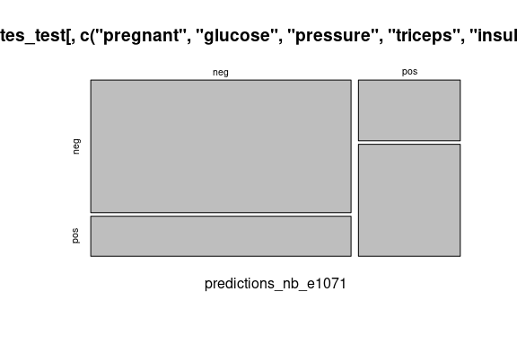
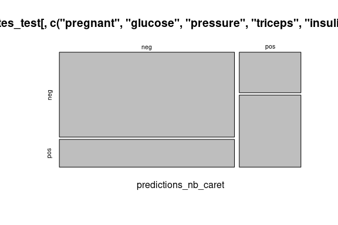

Business Intelligence Project
================
<Specify your name here>
<Specify the date when you submitted the lab>

- [Student Details](#student-details)
- [Setup Chunk](#setup-chunk)
- [STEP 1. Install and Load the Required
  Packages](#step-1-install-and-load-the-required-packages)
- [STEP 2. Load the dataset](#step-2-load-the-dataset)
  - [Splitting the dataset into train and test
    sets](#splitting-the-dataset-into-train-and-test-sets)
- [Train the model](#train-the-model)
- [STEP3. Test the model using the testing
  dataset](#step3-test-the-model-using-the-testing-dataset)
- [STEP4:Bootstrapping](#step4bootstrapping)
- [STEP5:CV, Repeated CV, and LOOCV](#step5cv-repeated-cv-and-loocv)
- [STEP6: Classification: LDA with k-fold Cross
  Validation](#step6-classification-lda-with-k-fold-cross-validation)
- [STEP7: Classification: Naive Bayes with Repeated k-fold Cross
  Validation](#step7-classification-naive-bayes-with-repeated-k-fold-cross-validation)
  - [4.b. Test the trained naive Bayes classifier
    —-](#4b-test-the-trained-naive-bayes-classifier--)
  - [4.c. View a summary of the naive Bayes model and the confusion
    matrix
    —-](#4c-view-a-summary-of-the-naive-bayes-model-and-the-confusion-matrix--)
  - [5. Classification: SVM with Repeated k-fold Cross Validation
    —-](#5-classification-svm-with-repeated-k-fold-cross-validation--)
    - [5.a. SVM Classifier using 5-fold cross validation with 3 reps
      —-](#5a-svm-classifier-using-5-fold-cross-validation-with-3-reps--)
    - [5.b. Test the trained SVM model
      —-](#5b-test-the-trained-svm-model--)
    - [5.c. View a summary of the model and view the confusion matrix
      —-](#5c-view-a-summary-of-the-model-and-view-the-confusion-matrix--)
  - [6. Classification: Naive Bayes with Leave One Out Cross Validation
    —-](#6-classification-naive-bayes-with-leave-one-out-cross-validation--)
    - [6.a. Train a Naive Bayes classifier based on an LOOCV
      —-](#6a-train-a-naive-bayes-classifier-based-on-an-loocv--)
    - [6.b. Test the trained model using the testing dataset
      —-](#6b-test-the-trained-model-using-the-testing-dataset--)
    - [6.c. View the confusion matrix
      —-](#6c-view-the-confusion-matrix--)

# Student Details

|                                              |                                              |
|----------------------------------------------|----------------------------------------------|
| **Student ID Number**                        | 112827,132234,134265                         |
| **Student Name**                             | Kenneth Mungai,Kelly Noella, Emmanuel Kiptoo |
| **BBIT 4.2 Group**                           | A,B                                          |
| **BI Project Group Name/ID (if applicable)** | Lumin                                        |

# Setup Chunk

**Note:** the following KnitR options have been set as the global
defaults: <BR>
`knitr::opts_chunk$set(echo = TRUE, warning = FALSE, eval = TRUE, collapse = FALSE, tidy = TRUE)`.

More KnitR options are documented here
<https://bookdown.org/yihui/rmarkdown-cookbook/chunk-options.html> and
here <https://yihui.org/knitr/options/>.

# STEP 1. Install and Load the Required Packages

``` r
### caret ----
if (require("caret")) {
  require("caret")
} else {
  install.packages("caret", dependencies = TRUE,
                   repos = "https://cloud.r-project.org")
}
```

    ## Loading required package: caret

    ## Loading required package: ggplot2

    ## Loading required package: lattice

``` r
### klaR ----
if (require("klaR")) {
  require("klaR")
} else {
  install.packages("klaR", dependencies = TRUE,
                   repos = "https://cloud.r-project.org")
}
```

    ## Loading required package: klaR

    ## Loading required package: MASS

``` r
### e1071 ----
if (require("e1071")) {
  require("e1071")
} else {
  install.packages("e1071", dependencies = TRUE,
                   repos = "https://cloud.r-project.org")
}
```

    ## Loading required package: e1071

``` r
### readr ----
if (require("readr")) {
  require("readr")
} else {
  install.packages("readr", dependencies = TRUE,
                   repos = "https://cloud.r-project.org")
}
```

    ## Loading required package: readr

``` r
### LiblineaR ----
if (require("LiblineaR")) {
  require("LiblineaR")
} else {
  install.packages("LiblineaR", dependencies = TRUE,
                   repos = "https://cloud.r-project.org")
}
```

    ## Loading required package: LiblineaR

``` r
### naivebayes ----
if (require("naivebayes")) {
  require("naivebayes")
} else {
  install.packages("naivebayes", dependencies = TRUE,
                   repos = "https://cloud.r-project.org")
}
```

    ## Loading required package: naivebayes

    ## naivebayes 0.9.7 loaded

``` r
### mlbench ----
if (require("mlbench")) {
  require("mlbench")
} else {
  install.packages("mlbench", dependencies = TRUE,
                   repos = "https://cloud.r-project.org")
}
```

    ## Loading required package: mlbench

``` r
library(readr)
```

# STEP 2. Load the dataset

``` r
## STEP 2. Load the dataset ----
data(PimaIndiansDiabetes)
summary(PimaIndiansDiabetes)
```

    ##     pregnant         glucose         pressure         triceps     
    ##  Min.   : 0.000   Min.   :  0.0   Min.   :  0.00   Min.   : 0.00  
    ##  1st Qu.: 1.000   1st Qu.: 99.0   1st Qu.: 62.00   1st Qu.: 0.00  
    ##  Median : 3.000   Median :117.0   Median : 72.00   Median :23.00  
    ##  Mean   : 3.845   Mean   :120.9   Mean   : 69.11   Mean   :20.54  
    ##  3rd Qu.: 6.000   3rd Qu.:140.2   3rd Qu.: 80.00   3rd Qu.:32.00  
    ##  Max.   :17.000   Max.   :199.0   Max.   :122.00   Max.   :99.00  
    ##     insulin           mass          pedigree           age        diabetes 
    ##  Min.   :  0.0   Min.   : 0.00   Min.   :0.0780   Min.   :21.00   neg:500  
    ##  1st Qu.:  0.0   1st Qu.:27.30   1st Qu.:0.2437   1st Qu.:24.00   pos:268  
    ##  Median : 30.5   Median :32.00   Median :0.3725   Median :29.00            
    ##  Mean   : 79.8   Mean   :31.99   Mean   :0.4719   Mean   :33.24            
    ##  3rd Qu.:127.2   3rd Qu.:36.60   3rd Qu.:0.6262   3rd Qu.:41.00            
    ##  Max.   :846.0   Max.   :67.10   Max.   :2.4200   Max.   :81.00

``` r
# The str() function is used to compactly display the structure (variables
# and data types) of the dataset
str(PimaIndiansDiabetes)
```

    ## 'data.frame':    768 obs. of  9 variables:
    ##  $ pregnant: num  6 1 8 1 0 5 3 10 2 8 ...
    ##  $ glucose : num  148 85 183 89 137 116 78 115 197 125 ...
    ##  $ pressure: num  72 66 64 66 40 74 50 0 70 96 ...
    ##  $ triceps : num  35 29 0 23 35 0 32 0 45 0 ...
    ##  $ insulin : num  0 0 0 94 168 0 88 0 543 0 ...
    ##  $ mass    : num  33.6 26.6 23.3 28.1 43.1 25.6 31 35.3 30.5 0 ...
    ##  $ pedigree: num  0.627 0.351 0.672 0.167 2.288 ...
    ##  $ age     : num  50 31 32 21 33 30 26 29 53 54 ...
    ##  $ diabetes: Factor w/ 2 levels "neg","pos": 2 1 2 1 2 1 2 1 2 2 ...

``` r
library(readr)
```

## Splitting the dataset into train and test sets

``` r
### 1. Split the dataset ----
# Define a 75:25 train:test data split of the dataset.
# 75% to train and 25% to test the model

train_index <- createDataPartition(PimaIndiansDiabetes$diabetes,
                                   p = 0.75,
                                   list = FALSE)
pima_indians_diabetes_train <- PimaIndiansDiabetes[train_index, ]
pima_indians_diabetes_test <- PimaIndiansDiabetes[-train_index, ]

library(readr)
```

# Train the model

``` r
#### 2.a OPTION 1: naiveBayes() function in the e1071 package ----

PimaIndiansDiabetes_model_nb_e1071 <- # nolint
  e1071::naiveBayes(diabetes ~ pregnant + glucose + 
                      pressure + triceps +
                      insulin +
                      mass + pedigree +
                      age,
                    data = pima_indians_diabetes_train)
 
#### 2.b. OPTION 2: naiveBayes() function in the caret package ----
PimaIndiansDiabetes_model_nb_caret <- # nolint
  caret::train(diabetes ~ ., data =
                 pima_indians_diabetes_train[, c("pregnant", "age", "glucose",
                                             "pressure", "triceps", "insulin",
                                             "mass",
                                             "pedigree",
                                             "diabetes"
                                             )],
               method = "naive_bayes")

#### 2.c OPTION 3: "NaiveBayes()" function in the "klaR" package ----
PimaIndiansDiabetes_model_nb_klaR <- # nolint
  klaR::NaiveBayes(`diabetes` ~ .,
                   data = pima_indians_diabetes_train)

library(readr)
```

# STEP3. Test the model using the testing dataset

``` r
#### 3.a Test the e1071 Naive Bayes model ----

predictions_nb_e1071 <-
  predict(PimaIndiansDiabetes_model_nb_e1071,
          pima_indians_diabetes_test[, c("pregnant", "glucose",
                                     "pressure", "triceps", "insulin",
                                     "mass","pedigree", "age")])

#### 3.b Test the caret Naive Bayes model ----

predictions_nb_caret <-
  predict(PimaIndiansDiabetes_model_nb_caret,
          pima_indians_diabetes_test[, c("pregnant", "glucose",
                                         "pressure", "triceps", "insulin",
                                         "mass","pedigree", "age")])

### 4. Results ----
#### 4.a e1071 Naive Bayes model ----
print(predictions_nb_e1071)
```

    ##   [1] neg pos pos neg pos neg neg neg neg pos neg neg neg neg neg neg neg neg
    ##  [19] neg neg pos neg pos neg neg neg neg neg neg neg neg neg neg neg neg pos
    ##  [37] pos neg neg neg neg neg neg neg pos pos neg neg pos neg pos neg neg neg
    ##  [55] pos neg neg neg neg pos neg neg neg neg neg neg neg neg neg neg pos neg
    ##  [73] pos neg neg neg neg pos neg pos neg pos pos pos neg neg neg neg pos neg
    ##  [91] pos pos neg neg neg neg neg pos pos neg neg neg neg neg pos neg pos neg
    ## [109] neg neg neg neg pos neg neg pos neg pos neg neg neg neg neg pos neg neg
    ## [127] neg neg neg neg pos pos pos neg neg neg neg neg pos pos pos neg pos neg
    ## [145] neg neg pos neg neg neg neg neg pos neg pos neg pos neg pos pos neg pos
    ## [163] pos neg pos neg neg neg pos neg neg neg neg neg neg neg neg neg neg neg
    ## [181] neg pos neg neg pos pos pos neg pos neg neg neg
    ## Levels: neg pos

``` r
caret::confusionMatrix(predictions_nb_e1071,
                       pima_indians_diabetes_test[, c("pregnant", "glucose",
                                                      "pressure", "triceps",
                                                      "insulin",
                                                      "mass","pedigree", 
                                                      "age",
                                                      "diabetes")]$diabetes)
```

    ## Confusion Matrix and Statistics
    ## 
    ##           Reference
    ## Prediction neg pos
    ##        neg 106  32
    ##        pos  19  35
    ##                                          
    ##                Accuracy : 0.7344         
    ##                  95% CI : (0.666, 0.7954)
    ##     No Information Rate : 0.651          
    ##     P-Value [Acc > NIR] : 0.008462       
    ##                                          
    ##                   Kappa : 0.3878         
    ##                                          
    ##  Mcnemar's Test P-Value : 0.092892       
    ##                                          
    ##             Sensitivity : 0.8480         
    ##             Specificity : 0.5224         
    ##          Pos Pred Value : 0.7681         
    ##          Neg Pred Value : 0.6481         
    ##              Prevalence : 0.6510         
    ##          Detection Rate : 0.5521         
    ##    Detection Prevalence : 0.7188         
    ##       Balanced Accuracy : 0.6852         
    ##                                          
    ##        'Positive' Class : neg            
    ## 

``` r
plot(table(predictions_nb_e1071,
           pima_indians_diabetes_test[, c("pregnant", "glucose",
                                          "pressure", "triceps",
                                          "insulin",
                                          "mass","pedigree", 
                                          "age",
                                          "diabetes")]$diabetes))
```

<!-- -->

``` r
#### 4. b caret Naive Bayes model ----
print(PimaIndiansDiabetes_model_nb_caret)
```

    ## Naive Bayes 
    ## 
    ## 576 samples
    ##   8 predictor
    ##   2 classes: 'neg', 'pos' 
    ## 
    ## No pre-processing
    ## Resampling: Bootstrapped (25 reps) 
    ## Summary of sample sizes: 576, 576, 576, 576, 576, 576, ... 
    ## Resampling results across tuning parameters:
    ## 
    ##   usekernel  Accuracy   Kappa    
    ##   FALSE      0.7538203  0.4511887
    ##    TRUE      0.7577988  0.4599236
    ## 
    ## Tuning parameter 'laplace' was held constant at a value of 0
    ## Tuning
    ##  parameter 'adjust' was held constant at a value of 1
    ## Accuracy was used to select the optimal model using the largest value.
    ## The final values used for the model were laplace = 0, usekernel = TRUE
    ##  and adjust = 1.

``` r
caret::confusionMatrix(predictions_nb_caret,
                       pima_indians_diabetes_test[, c("pregnant", "glucose",
                                                      "pressure", "triceps",
                                                      "insulin",
                                                      "mass","pedigree", 
                                                      "age",
                                                      "diabetes")]$diabetes)
```

    ## Confusion Matrix and Statistics
    ## 
    ##           Reference
    ## Prediction neg pos
    ##        neg 107  35
    ##        pos  18  32
    ##                                          
    ##                Accuracy : 0.724          
    ##                  95% CI : (0.655, 0.7859)
    ##     No Information Rate : 0.651          
    ##     P-Value [Acc > NIR] : 0.01910        
    ##                                          
    ##                   Kappa : 0.3545         
    ##                                          
    ##  Mcnemar's Test P-Value : 0.02797        
    ##                                          
    ##             Sensitivity : 0.8560         
    ##             Specificity : 0.4776         
    ##          Pos Pred Value : 0.7535         
    ##          Neg Pred Value : 0.6400         
    ##              Prevalence : 0.6510         
    ##          Detection Rate : 0.5573         
    ##    Detection Prevalence : 0.7396         
    ##       Balanced Accuracy : 0.6668         
    ##                                          
    ##        'Positive' Class : neg            
    ## 

``` r
plot(table(predictions_nb_caret,
           pima_indians_diabetes_test[, c("pregnant", "glucose",
                                          "pressure", "triceps",
                                          "insulin",
                                          "mass","pedigree", 
                                          "age",
                                          "diabetes")]$diabetes))
```

<!-- -->

``` r
library(readr)
```

# STEP4:Bootstrapping

``` r
### 1. Split the dataset ----
# Define a 75:25 train:test data split of the dataset.
# 75% to train and 25% to test the model

train_index <- createDataPartition(PimaIndiansDiabetes$diabetes,
                                   p = 0.75,
                                   list = FALSE)
pima_indians_diabetes_train <- PimaIndiansDiabetes[train_index, ]
pima_indians_diabetes_test <- PimaIndiansDiabetes[-train_index, ]

### 2. Train a  classification model ----
#### 2.a Train control  ----
train_control <- trainControl(method = "cv", number = 10)

PimaIndiansDiabetes_model_logit <- # nolint
  train(`diabetes` ~
                 `pregnant` + `glucose` +
                 `pressure` + `triceps` +
                 `insulin` + `mass` +
                 `pedigree` +
                 `age`,
               data = pima_indians_diabetes_train,
               trControl = train_control,
               na.action = na.omit, method = "glm", family ="binomial", 
        metric = "Accuracy")

### 3. Test the trained linear regression model   ----
predictions_logit <- predict(PimaIndiansDiabetes_model_logit,
                          pima_indians_diabetes_test[, c("pregnant", "glucose",
                                                         "pressure", "triceps",
                                                         "insulin",
                                                         "mass","pedigree", 
                                                         "age",
                                                         "diabetes")])

### 4. Results   ----
print(PimaIndiansDiabetes_model_logit)
```

    ## Generalized Linear Model 
    ## 
    ## 576 samples
    ##   8 predictor
    ##   2 classes: 'neg', 'pos' 
    ## 
    ## No pre-processing
    ## Resampling: Cross-Validated (10 fold) 
    ## Summary of sample sizes: 518, 518, 519, 518, 518, 519, ... 
    ## Resampling results:
    ## 
    ##   Accuracy   Kappa    
    ##   0.7675439  0.4582328

``` r
print(predictions_logit)
```

    ##   [1] neg pos neg neg neg neg pos pos pos pos pos pos pos neg pos neg pos neg
    ##  [19] neg pos neg neg pos neg neg neg neg neg neg neg pos neg neg neg neg neg
    ##  [37] pos pos neg neg neg pos neg pos pos neg neg pos pos pos pos neg neg neg
    ##  [55] pos neg pos neg neg pos pos neg pos neg neg pos pos neg neg pos pos pos
    ##  [73] neg neg neg pos pos pos neg neg pos pos neg neg neg neg neg pos neg pos
    ##  [91] pos pos pos neg neg pos neg neg pos neg neg neg neg neg neg pos neg pos
    ## [109] neg neg pos neg neg pos neg neg neg neg pos neg pos neg neg neg pos neg
    ## [127] neg pos neg neg neg neg neg neg neg neg neg neg pos neg neg neg neg neg
    ## [145] neg pos neg pos neg neg pos neg pos pos neg neg neg neg neg neg neg neg
    ## [163] neg pos neg neg neg neg pos neg neg neg pos neg neg pos pos pos neg neg
    ## [181] neg neg neg pos neg pos neg pos neg pos neg neg
    ## Levels: neg pos

``` r
library(readr)
```

# STEP5:CV, Repeated CV, and LOOCV

``` r
### 1. Split the dataset ----
# Define a 75:25 train:test data split of the dataset.
# 75% to train and 25% to test the model

train_index <- createDataPartition(PimaIndiansDiabetes$diabetes,
                                   p = 0.75,
                                   list = FALSE)
pima_indians_diabetes_train <- PimaIndiansDiabetes[train_index, ]
pima_indians_diabetes_test <- PimaIndiansDiabetes[-train_index, ]

### 2. Regression: Linear model      ----
#### 2.a  10-fold cross validation  ----
train_control <- trainControl(method = "cv", number = 10)

PimaIndiansDiabetes_model_lm <- # nolint
  train(`diabetes` ~
          `pregnant` + `glucose` +
          `pressure` + `triceps` +
          `insulin` + `mass` +
          `pedigree` +
          `age`,
        data = pima_indians_diabetes_train,
        trControl = train_control,
        na.action = na.omit, method = "glm", 
        metric = "Accuracy")

#### 2.b Test the trained model   ----
predictions_lm <- predict(PimaIndiansDiabetes_model_lm, pima_indians_diabetes_test[,c("pregnant", "glucose",
                                                                                      "pressure", "triceps",
                                                                                      "insulin",
                                                                                      "mass","pedigree", 
                                                                                      "age",
                                                                                      "diabetes")])

### 2.c. View the RMSE and the predicted values ====
print(PimaIndiansDiabetes_model_lm)
```

    ## Generalized Linear Model 
    ## 
    ## 576 samples
    ##   8 predictor
    ##   2 classes: 'neg', 'pos' 
    ## 
    ## No pre-processing
    ## Resampling: Cross-Validated (10 fold) 
    ## Summary of sample sizes: 519, 518, 517, 518, 518, 519, ... 
    ## Resampling results:
    ## 
    ##   Accuracy  Kappa    
    ##   0.778205  0.4889419

``` r
print(predictions_lm)
```

    ##   [1] pos pos neg neg pos pos neg neg neg neg pos pos neg neg neg neg neg pos
    ##  [19] neg neg neg neg neg neg neg neg neg neg neg neg neg neg neg pos neg neg
    ##  [37] neg pos neg neg neg neg pos neg pos neg neg pos neg pos pos pos neg neg
    ##  [55] neg pos neg neg neg neg pos pos pos pos neg neg pos neg neg neg neg neg
    ##  [73] neg pos neg neg pos neg neg pos neg neg neg pos neg neg neg neg neg neg
    ##  [91] neg pos neg pos neg neg neg neg neg neg neg neg neg neg neg pos pos neg
    ## [109] pos neg neg neg pos neg neg neg neg neg neg neg pos pos neg neg pos neg
    ## [127] neg neg neg neg neg neg neg pos neg pos neg neg neg pos neg pos pos neg
    ## [145] pos neg neg neg neg neg neg pos neg neg pos neg neg neg neg neg neg pos
    ## [163] neg pos neg neg neg pos neg neg pos neg pos neg pos neg neg pos neg pos
    ## [181] pos neg neg neg neg neg pos pos pos pos pos neg
    ## Levels: neg pos

``` r
library(readr)
```

# STEP6: Classification: LDA with k-fold Cross Validation

``` r
#### 3.a LDA classifier based on a 5-fold CV    ----
PimaIndiansDiabetes_model_lda <-
  caret::train(`diabetes` ~ ., data = pima_indians_diabetes_train,
               trControl = train_control, na.action = na.omit, method = "lda2",
               metric = "Accuracy")

#### 3.b Test the trained LDA model   ----
predictions_lda <- predict(PimaIndiansDiabetes_model_lda,
                           pima_indians_diabetes_test[, c("pregnant", "glucose",
                                                          "pressure", "triceps",
                                                          "insulin",
                                                          "mass","pedigree", 
                                                          "age",
                                                          "diabetes")])

#### 3.c. View the summary of the model and view the confusion matrix ----
print(PimaIndiansDiabetes_model_lda)
```

    ## Linear Discriminant Analysis 
    ## 
    ## 576 samples
    ##   8 predictor
    ##   2 classes: 'neg', 'pos' 
    ## 
    ## No pre-processing
    ## Resampling: Cross-Validated (10 fold) 
    ## Summary of sample sizes: 519, 519, 519, 518, 518, 517, ... 
    ## Resampling results:
    ## 
    ##   Accuracy   Kappa    
    ##   0.7707681  0.4733455
    ## 
    ## Tuning parameter 'dimen' was held constant at a value of 1

``` r
caret::confusionMatrix(predictions_lda, pima_indians_diabetes_test$diabetes)
```

    ## Confusion Matrix and Statistics
    ## 
    ##           Reference
    ## Prediction neg pos
    ##        neg 108  29
    ##        pos  17  38
    ##                                           
    ##                Accuracy : 0.7604          
    ##                  95% CI : (0.6937, 0.8189)
    ##     No Information Rate : 0.651           
    ##     P-Value [Acc > NIR] : 0.0007157       
    ##                                           
    ##                   Kappa : 0.4499          
    ##                                           
    ##  Mcnemar's Test P-Value : 0.1048330       
    ##                                           
    ##             Sensitivity : 0.8640          
    ##             Specificity : 0.5672          
    ##          Pos Pred Value : 0.7883          
    ##          Neg Pred Value : 0.6909          
    ##              Prevalence : 0.6510          
    ##          Detection Rate : 0.5625          
    ##    Detection Prevalence : 0.7135          
    ##       Balanced Accuracy : 0.7156          
    ##                                           
    ##        'Positive' Class : neg             
    ## 

``` r
library(readr)
```

# STEP7: Classification: Naive Bayes with Repeated k-fold Cross Validation

\`\``{step-nine-chunk} #### 4.a. Train an e1071::naive Bayes classifier based on the diabetes variable ---- PimaIndiansDiabetes_model_nb <-   e1071::naiveBayes(`diabetes\`
~ ., data = pima_indians_diabetes_train)

#### 4.b. Test the trained naive Bayes classifier —-

predictions_nb_e1071 \<- predict(PimaIndiansDiabetes_model_nb,
pima_indians_diabetes_test\[, 1:9\])

#### 4.c. View a summary of the naive Bayes model and the confusion matrix —-

print(PimaIndiansDiabetes_model_nb)
caret::confusionMatrix(predictions_nb_e1071,
pima_indians_diabetes_test\$diabetes)

### 5. Classification: SVM with Repeated k-fold Cross Validation —-

#### 5.a. SVM Classifier using 5-fold cross validation with 3 reps —-

train_control \<- trainControl(method = “repeatedcv”, number = 5,
repeats = 3)

PimaIndiansDiabetes_model_svm \<- caret::train(`diabetes` ~ ., data =
pima_indians_diabetes_train, trControl = train_control, na.action =
na.omit, method = “svmLinearWeights2”, metric = “Accuracy”)

#### 5.b. Test the trained SVM model —-

predictions_svm \<- predict(PimaIndiansDiabetes_model_svm,
pima_indians_diabetes_test\[, 1:9\])

#### 5.c. View a summary of the model and view the confusion matrix —-

print(PimaIndiansDiabetes_model_svm)
caret::confusionMatrix(predictions_svm,
pima_indians_diabetes_test\$diabetes)

### 6. Classification: Naive Bayes with Leave One Out Cross Validation —-

#### 6.a. Train a Naive Bayes classifier based on an LOOCV —-

train_control \<- trainControl(method = “LOOCV”)

PimaIndiansDiabetes_nb_loocv \<- caret::train(`diabetes` ~ ., data =
pima_indians_diabetes_train, trControl = train_control, na.action =
na.omit, method = “naive_bayes”, metric = “Accuracy”)

#### 6.b. Test the trained model using the testing dataset —-

predictions_nb_loocv \<- predict(PimaIndiansDiabetes_nb_loocv,
pima_indians_diabetes_test\[, 1:9\])

#### 6.c. View the confusion matrix —-

print(PimaIndiansDiabetes_nb_loocv)
caret::confusionMatrix(predictions_nb_loocv,
pima_indians_diabetes_test\$diabetes)

library(readr) \`\`\`
